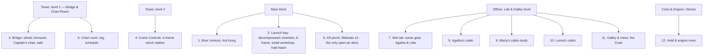
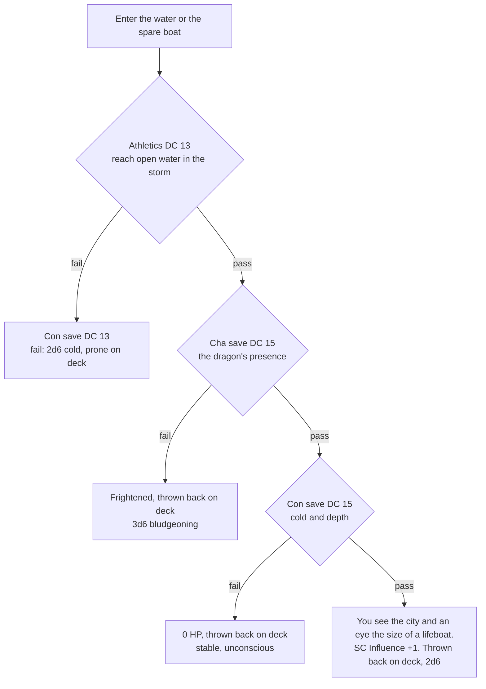

# Operation: Wet Pages — DM Document

2026-09-17 · @tgmf

## Session frame

A 3–4 hour heist one-shot for three new players (D&D 2024 rules, level 4 — a feat each, no third-level spells) aboard the research vessel **Reckless** on its first expedition to Catlantis — except the PCs aren't really there yet (see The frame). Canon is a source, not a cage: the only fixed points, true whenever the real mission actually runs, are that the descent happens and Rokko is lost.

**The situation.** Lunna — Marty's sister — is aboard as a "journalist fleeing pirates" whom Rokko rescued in Livanu right before sailing. The cell already tried to retrieve her in Livanu; she refused and boarded anyway, because she wants to be near Marty and cannot do it safely: the Glowing Cats are hunting him. The cell, under **Captain Jack Purrow** ("pirates" are this cell's standing cover), now tails the Reckless and sends a four-cat team: three PCs and an NPC music-box operator. The Reckless is at anchor over the sonar anomaly.

**What the PCs are told (Purrow's briefing — hand this out):**

1. **Find Lunna and bring her back.** We don't know if she boarded on her own or is being held.
2. **Take Agatha's research.** Copy it if you can, take it if you must.
3. **Disrupt whatever they are doing down there** — without anyone learning who you are.
4. Bonus: if the scientist or anyone else *gifted* wants to come along, bring them. Kidnap only if you're compromised or the papers are lost.
5. Keep the device away from the grey cat with the glasses. That's an order, not a suggestion.

Purrow also gives them **the Plan** (see Act I) — an order they may follow or drop.

**What the DM knows and the PCs don't.** The Resistance believes Marty, Rokko and Agatha are being steered by the Glowing Cats and that revealing itself would make Marty a bigger target; Marty's parents want him out of it for now. The team are low-level operatives; Purrow knows a little more, the PCs know only the briefing. Lunna knows far more than any of them, including that nobody on this team has the rank to promise her anything.

**Goal scoring:**

| Goal | Full | Partial | Fail |
| --- | --- | --- | --- |
| 1 · Lunna | Off the ship, Marty none the wiser | Stays by her own choice with a controlled channel | Marty learns who she is, or anyone gets hurt |
| 2 · Documents | Copied, originals untouched | Stolen | Nothing, or Agatha destroys them |
| 3 · Disrupt | Each success delays the descent one segment — time for goals 1–2 | — | The descent is a fixed point; it cannot be stopped, only delayed |
| Bonus A · Agatha | Recruited, or her influence broken | Taken by force (only if compromised / documents lost) | Over the rail (she survives; the SC own her) |
| Bonus B · Litta | Recruited willingly | Taken by force | Left aboard knowing too much |

**Inviolable rules**

- Marty and Rokko should not be harmed, by anyone, if one of them dies the crew is retracted and the run starts over.
- The descent happens and Rokko does not come back up, on every attempt. Disruption delays it; nothing prevents it.
- No NPC dies. The Filter makes that easy between cats; the fish are another matter.
- The music box never runs within 20 ft of Marty. If a player tries, the operator refuses (order): "The grey one is off limits, Captain's word."
- PCs can die, and a TPK is expected, not avoided — see The frame. It ends the attempt, not the session.
- If Rokko ever steps inside a running bubble, none of the above covers what happens next — see the note after Act I.

**Acts:** I Boarding (the plan collapses) → II Heist (three problems, one crowded deck) → Interlude (flying fish) → III Storm (dragon freed, Rokko lost, Agatha at the rail, the window closes).

## The frame: this is a rehearsal

Something the PCs don't know and the table does: none of Operation: Wet Pages is really happening yet. The team is lying in trance back aboard Purrow's ship, threaded into a shared vision by two divination wizards running a Resistance training protocol — they will only finish the ritual and make the dream real when all the goals are met. Everything in Acts I–III is that vision, played straight, with real stakes inside it. The fixed points (the descent, Rokko lost) land at the same beat on every attempt, because the vision is anchored to something true.

**A run ends for whatever reason it ends:** a TPK, one PC gone for good who wakes the others, a dispel, the party's cover blown past saving, the clock running out. The first ending is the reveal — see the note after Act I.

**Looping back in.** They re-enter the vision from whatever point they want in the story they've witnessed already. The ship resets clean: cabins relocked, Lunna undecided again, Agatha's blackout unremembered, every clock back to zero. The only thing that survives is what's in the players' heads — no items, no Inspiration, no mechanical carryover. There is no designated "real" run.

**Optional: a literal clock.** A run is six segments at about ten minutes each (see Clocks), so you can put a visible 60-minute timer on the table instead of tracking segments narratively — when it hits zero, the dream ends, wherever they are in the fiction.

## Key mechanics to teach

Five rules, introduced in this order: species and magic limits (character building, before the session), the Filter (Act I, first contact with crew), the music box and operator (first time a PC wants to cast), wild surge (first cast).

**1. The Filter** — a world-wide broadcast of the Glowing Cats' dying will. Active everywhere except inside a music-box bubble. It works on cats; Captain Sevastian is a marsupial and is untouched by it, and fish were never cats.

| Effect | Rule |
| --- | --- |
| Aggression suppressed (cat vs cat) | Disadvantage on attack rolls, damaging spells, Intimidation, and any check whose goal is to hurt or coerce a cat. PCs and NPCs alike. **Not against fish** — the flying-fish fight is the first time the players roll without it. |
| Graciousness | Cats respond to violence and theft with comic politeness ("Oh — do you need that? Take it, take it"). They still *remember* and grow puzzled; see the Suspicion clock. |
| Magic blindness | Cats cannot perceive or retain magic. A witnessed spell is rationalised within a round ("the lamp flickered"). Inside a bubble this stops — a cat who sees magic inside a bubble *keeps* it. |
| Fear of water | A Filter effect: any cat within 5 ft of open water makes a Charisma save DC 12 or spends the turn moving away (Charisma: it is a mental override of the self, the same save Agatha's influence uses). Sailors of the Reckless have advantage; the Captain is immune; **inside a bubble there is no fear roll.** |
| The worm of doubt | Once per session, a PC may spend Inspiration to ignore the Filter for one roll — the repentant Catlantans left a crack. |

Inside a bubble the Filter is jammed: no disadvantage, cats react to violence like real people (fear, anger, alarm), and they remember. A fight inside the bubble is loud and *kept*.

**Exception: dream magic.** It happens on a plane the Filter doesn't watch — no bubble needed, no surge, nothing to blind or block.

**2. The music-box interference device and its operator** — the Resistance's "noise machine", a hand-cranked music box, carried by the fourth member of the team, a dedicated NPC operator — **Tikk**.

- Radius 20 ft, centered on the box. Magic works only inside it. Stops the moment the crank stops.
- The operator cranks and moves: speed 30 ft, half that while cranking. Any PC may give the operator one command per turn as a free action ("follow me", "stay", "to the hatch"); the operator acts on their own initiative after the command was given. No command = the operator keeps doing the last thing.
- Operator stats: AC 12, 26 HP, does not fight, Stealth +3. If the operator is down or separated, a PC may crank instead — that costs the PC's **action** each turn.
- Audible at 30 ft (15 ft in the noisy hold): a thin waltz. Cats who hear it come to look — politely. Inaudible in the storm.
- The Filter blocks casting and perceiving, not the magic itself: an effect that is already running keeps running outside the bubble. Two exceptions. A mind effect on a cat (charm, sleep, suggestion) ends the moment that cat leaves the bubble — the Filter takes the mind back. And concentration ends the moment the caster is outside a bubble — whether they walked out or the bubble dropped around them (crank jam, operator down, box broken). It is impossible to concentrate on something you don't know exists.
- Fragile: AC 10, 5 HP. A second, damaged box is hidden in Lunna's cabin.
- Agatha's Glowing Cats influence is jammed inside the bubble.

**3. Wild surge** — the box disharmonizes the Filter rather than removing it. After every spell cast inside the bubble, the caster rolls d20; on 5 or lower, roll d20 on the surge table.

| d20 | Surge |
| --- | --- |
| 1 | Water: every liquid within 20 ft leaps 5 ft upward, then falls. Anyone holding a cup or a lantern: Dex save DC 12 or drop it. |
| 2 | Water: a wave slaps the nearest porthole or rail; 1d4 cold damage to the caster, and the caster is soaked (disadvantage on Stealth for 10 minutes — dripping). |
| 3 | Water: dense fog fills the bubble for 1 minute (heavily obscured). Great for hiding, bad for reading. |
| 4 | Water: a flying fish drops out of nowhere into the bubble, alive and furious. It Slaps the nearest cat (Dex save DC 12 or drop one held item) and flops for a round before anyone can catch it. The Cook wants it. Before the interlude, this is foreshadowing; after it, it's two fish. |
| 5 | Earth: wooden surfaces within 10 ft sprout leaves for 1 minute. Litta notices from anywhere on the ship. |
| 6 | Earth: a plank underfoot goes soft; each creature in the bubble makes a Dex save DC 12 or falls prone. |
| 7 | Earth: the caster's claws grow 1 inch and stay that way for an hour (+1 to unarmed strikes, −1 to Sleight of Hand). |
| 8 | Earth: a potted plant, a crate of turnips, or the Cook's onions within 20 ft doubles in size. |
| 9 | Mind: the caster hears every thought within 20 ft for 1 round. Read one out loud. |
| 10 | Mind: the nearest cat other than the caster falls asleep for 1 round (no save). |
| 11 | Mind: for 1 minute the caster sees other cats' dreams as faint pictures above their heads. Rokko's is the sea, always. |
| 12 | Mind: the caster forgets the last minute (the player still knows; the character doesn't). |
| 13 | The waltz doubles in volume for 1 minute (audible at 60 ft). |
| 14 | Bubble radius halves for 1 minute. |
| 15 | Bubble radius doubles for 1 round — check who is inside it now, including anyone who wasn't meant to be. |
| 16 | The caster glows faintly for 1 minute. The Glowing Cats notice (campaign hook; +1 SC Influence on the caster). |
| 17 | Echo: next round the same spell fires again from the caster, at a target of the DM's choice. |
| 18 | Refund: the spell slot is not spent. |
| 19 | The operator's crank jams for 1 round; the bubble drops. (If any concentration spell is running, reroll — this one is too expensive by accident.) |
| 20 | Clean cast, and the caster feels the Filter part like a curtain: advantage on the next roll of any kind. |

**4. Magic limits** — recommended rule: *any spell; fire and lightning damage do not exist in this world — reflavour it as cold or bludgeoning (water, earth) or pick another spell.*

**5. Species** — any species, as long as the player can describe it as a cat. On top of whatever they built: Darkvision 60 ft if they lack it, and the **Speedy** feat free.

## NPC roster

Nine named cats (one marsupial) aboard, plus 4–6 unnamed sailors. Stat blocks: commoner for crew; class hints are for skill bonuses only — nobody fights cats under the Filter, everybody fights fish.

| NPC | Role aboard | Disposition to strangers | What they know / can give | Session function |
| --- | --- | --- | --- | --- |
| **Marty** — Artificer/Cleric | Expedition psychologist & historian; Agatha's co-lead | Reserved, listens; hard to lie to (Insight +6) but misses emotional tells | Camera-glasses (photograph pages in a minute); talks one-on-one with crew (with Litta in beat 2) | Must not learn who Lunna is. Loses Rokko in Act III and will try to go after him |
| **Rokko** — Sorcerer | Student; Alvin pilot | Warm, curious, bets on anything; **reads moods perfectly** (auto-detects nerves, not the reason) | "Forecasts" the storm — it is not weather sense, it is the dragon and the future (secretly dream magic, the one kind that skips the bubble entirely — never explain it at the table); "rescued" Lunna in Livanu | Calls the descent early (end of Act I); goes down; **does not come back** |
| **Agatha** — Fighter 2 / Cleric, Sage | Doctor of aquatic sciences; owns the documents | Confident, forceful, explains her work to anyone who asks well; can and will hit. No Cha save proficiency: confident, learned, not self-aware | The documents; History/Religion, Medicine; her own blackouts (she doesn't know) | Goal 2 owner; Bonus A. **Cha save DC 13** when a trigger fires: fail = SC Influence +1; natural 1–5 during the beat 2 interview = she goes for her notebook (see Goal 1) |
| **Captain Sevastian** — Ranger/Fighter | Master of the Reckless | Stern, in his armchair; **appears mid-conversation anywhere, chair and all** (d6 each scene: 1 = he's there). **Not a cat (marsupial): the Filter does nothing to him.** Easygoing, unshockable; sees through a cover on a failed Deception but says nothing unless given a reason | Boats, winch, course, log; rescues castaways without question | Keeps a private ledger of what the PCs did. "A reason" = a crew member hurt or the ship endangered; then he acts, calmly and completely |
| **The Cook** — Rogue/Assassin | Ship's cook; Marty's friend | Quiet, watchful; the only cat who *notices* thieves | Keys, hidden spaces; feeds stowaways he has found and not reported | Stealth antagonist; the fish-fight's terror with a cleaver |
| **Yanni** — Rogue/Ranger | Cabin boy, kitten in a sailor suit, lisps | Instantly friendly; talks nonstop; wants toys | Goes anywhere unquestioned; carries notes, keys, even the box | Accomplice and leak in one |
| **Litta** — Druid | Ran away with Marty and Rokko (or right after); assists Agatha | Serious, searching, guarded about her gift | **Earth magic with real control** — at sea it stopped completely; a working bubble is the first magic she has felt since | Bonus B |
| **Kot Kong** — Barbarian/Fighter | Talisman and muscle; loyal to Rokko | Huge, gentle; carries intruders to the Captain "to be introduced" | Lifts the cable by paw | Boarding obstacle; holds Marty back from the water in Act III |
| **Lunna** — Rogue/Bard | Cover: journalist fleeing pirates, rescued by Rokko in Livanu | Charming, evasive; watches Marty | Knows the cell, Purrow, the SC's interest in Marty, and that the PCs cannot promise her anything. Has the damaged spare box, coded letters to Ikke, and copies of the charts and half the notebook | Goal 1. NPC only. Refused retrieval in Livanu; will refuse again unless the situation changes |
| Sailors ×4–6, bosun, helmsman, engineer | Deck crew | Gracious, curious, superstitious about water | Gossip; nets and pans (fish fight) | Extras |

**The fourth member of the team:** **Tikk**, the operator — see Mechanics 2. Loyal to Purrow's orders over the PCs' wishes when they conflict (the Marty rule).

**Deck crew routines.**

- **Helmsman** — always at the wheel (Location 3), rain or shine. Never patrols, never leaves. The single most predictable body on the ship.
- **Bosun** — orbits bow → midship → stern roughly once a segment, chivvying the deck crew; joins the winch effort the moment descent prep starts.
- **Engineer** — belowdecks in the engine room (Location 12), essentially unseen except at watch changes (once pre-descent, once mid-storm) — for stealth purposes, treat the engine room as empty the rest of the time.
- **Sailors (×4–6)** — bow lookout and rigging by day, galley at mealtimes, lifeboats the moment the storm hits. Scenery unless a PC gives one of them a specific reason to look twice.

**Off-ship:** **Captain Jack Purrow** and the tailing vessel — the Slipping FLoppy — 16 Resistance sailors under pirate colours, one spare box, a rowboat. They act only on the PCs' lantern signal (three long) and can stage a "pirate attack" once. Purrow knows more than the PCs; he tells them nothing extra unless they ask the right question at the briefing ("why can't we use the device near the grey one?" — "because his parents said so").

## Locations aboard the Reckless
 
The Reckless is an enclosed, cat-adapted diesel research vessel — 125 ft (38.1 m) LOA, 31 ft beam, bow thruster — built tall and curved rather than long and flat, so cats can live several levels up without ever standing near open water. Most of the hull is covered; A two-level stern tower holds the Bridge and the Chart Room in one shared ~25 ft room (Tower, level 2) over Crane Controls (Tower, level 1), so the Captain never has to leave the wheel to check a chart. The *Alvin* launches from a side-mounted A-frame amidships, not a crane over open water.
 
Keep the map on the table; the heist is about who is where.
 

Upper deck is open and watched; cabin deck is where the goals are; lower deck is where stowaways hide.

| # | Location | What's here | Locks / obstacles | Who, when |
| --- | --- | --- | --- | --- |
| 1 | Bow | Lookout post, anchor chain (Route 1 climb) | Kot Kong (day); 1 sailor (night) | Kot Kong day; sailor night |
| 2 | Midship | Alvin on its crane, winch, cable drum, main hold hatch | Winch needs 2 cats or Kot Kong; hatch is Kot Kong's bed at night | Rokko + Captain before descent; Kot Kong night |
| 3 | Stern | Wheel, binnacle, the Captain's armchair, **the Captain's safe (the master folio, Goal 2)**, stern ladder (Route 1 alt) | Helmsman always present; the safe is under an arcane lock | Helmsman always; Captain in beats 3–4 (d6=1 anywhere else) |
| 4 | Rigging / crow's nest | Overview of both ships; lantern for signalling | Athletics DC 12 to climb quietly | 1 sailor by day; empty at night |
| 5 | Lifeboats (2) | Extraction craft; each takes 6 | Lashed; davits squeal (Perception DC 10 within 30 ft) | Empty; crew rush here in the storm |
| 6 | Chart room | Ship's log, expedition schedule, the Captain's spare key ring (shares the bridge room) | Unlocked by day, locked at night (DC 13) | Empty; the Captain in beats 3–4 |
| 7 | Wet lab | Echo-locator, **the charts cupboard** (Goal 2), Litta's plant trays, Lunna's "journalist" desk | Cupboard: flimsy, DC 10 | Litta in beats 1 and 4–5, Agatha in beats 4–6; empty in beats 2–3 |
| 8 | Agatha's cabin | **Her notebook** (in the desk drawer after the interview, Goal 2), her sleep-log she doesn't remember writing (Bonus A clue; Lunna's proof) | Cabin DC 12; key on Agatha | Beat 2: Agatha and Lunna (the interview); empty from beat 3 |
| 9 | Marty's cabin-study | Camera-glasses on the desk when he sleeps, notes on the crew (including one about the journalist who avoids him), psychoanalysis couch | Never locked; Marty is a light sleeper (Stealth DC 14) | Beat 2: Marty and Litta talk; beat 3: Lunna alone |
| 10 | Lunna's cabin | Half-finished copy of the documents, damaged spare music box, coded letters to Ikke | Locked DC 14 (she's careful) | Empty: after supper she is never in it |
| 11 | Galley & mess | Food, knives, the Cook, a hatch to stores, everyone passes through | The Cook notices everything (Perception +7) | The Cook always; crew at meals |
| 12 | Hold & engine room | Crates, Alvin spares, spare boat, fuel, noise that masks a music box (audible radius 15 ft here) | Engine room hot and noisy | Empty except engineer at watch changes |

**Schedule, by beat** — six beats per run, about two hours of ship time each (Act I is unclocked, before beat 1). P1–P3 are beats 1–3 (pre-descent, after Rokko's push); W1–W3 are beats 4–6 (the post-descent window, same beats as the Act III table). People move around inside a beat; the table shows where each spends most of it. Lunna's interview with Agatha, Marty's talk with Litta and the Cook-and-Yanni knife lesson are all pinned to beat 2 on purpose — see Goals 1 and 2.

| Beat | What's happening | Rokko | Marty | Lunna | Agatha | Litta | Captain | Cook & Yanni | Kot Kong |
| --- | --- | --- | --- | --- | --- | --- | --- | --- | --- |
| 1 · P1 (Rokko's push) | Supper in the mess; Rokko announces the storm and the crew ready the ship | Mess | Mess | Mess, watching Marty | Mess (notebook in her satchel) | Wet lab | Mess | Both in the mess | Bow |
| 2 · P2 (prep) | Crane and cable checks, lamps lit. **Two talks in parallel:** Lunna interviews Agatha; Marty talks with Litta | Own cabin | His study, with Litta | Agatha's cabin, interviewing her | Own cabin, being interviewed | His study, with Marty | Alvin hatch | **Knife-sharpening lesson, galley** — both occupied with each other | Bow |
| 3 · P3 (the dive) | Rokko goes down; the clock flips to the Window | Into the Alvin — descends | Alvin hatch | His study, alone | Alvin hatch | Galley | Bridge | Cook: galley. Yanni: rigging | Midship |
| 4 · W1 · Sky & Rain | Sky goes green, then rain — Agatha's Cha save fires | Below, piloting (unseen) | Crane controls, alone | Rokko's cabin | Wet lab (may walk to the rail in the rain) | Wet lab | Bridge | Cook: galley, then fighting fish if they've arrived. Yanni: crew quarters | Midship |
| 5 · W2 · Waves & the Cable | Ship heels; the cable goes slack, taut, slack | Loose below | Crane controls, with Lunna | Crane controls, with Marty | Wet lab | Wet lab, losing the signal | Midship | Cook: midship, fighting fish. Yanni: hold and store | Winch — first to feel the cable go wrong |
| 6 · W3 · Empty Hook & Calm | Cable cut, Rokko gone; storm drops; dawn, headcount | Gone | Winch, then goes for the rail — PCs (and Kot Kong) must stop him | Life capsule, with the bosun; knows what this means | Wet lab, then the rail | Winch; comes up on deck when word spreads | Midship | Cook: midship. Yanni: crew quarters | Winch, then the rail with Marty — must stop him without hurting him |

Also: the helmsman is always on the bridge; the engineer is in the engine room except beat 2 (hold, Alvin hatch) and beat 5 (bow); the bosun does his rounds bow–midship–stern in beats 1–3, is at the Alvin hatch in beat 4, the stern in beat 5 and the life capsule in beat 6; two sailors man the winch in beats 3–4.

**Ambient life, one per segment.** Emergency filler for when you lose the thread and need a quick scene or a nudge forward — the ship keeps living whether or not the PCs are watching. Pure texture, not new mechanics.

- **Act I:** Kot Kong, alone at the bow, spends half the scene stalking a gull that's landed on the rail. He never catches it, and he's delighted every time it gets away.
- **P1:** Two off-duty sailors argue, loudly enough to hear from the chart room, about whose watch it was to grease the winch.
- **P2:** The helmsman hums the same three notes of a work-song, over and over, for the whole segment. Nobody else on deck seems to notice.
- **P3:** Litta feeds a stray dockyard cat that stowed away weeks ago and now lives quietly in the hold. Nobody's told the Captain.
- **W1:** A sailor loses his hat over the rail in the first gust and spends the rest of the segment pretending he meant to.
- **W2:** The engineer surfaces from belowdecks just long enough to shout that the diesel's fine, then vanishes again.
- **W3:** The bosun does a headcount out loud, twice, and gets a different number both times.

## Act I — Boarding and the plan that collapses (≈10 min)

**The Plan (Purrow's order, given before the mission).** *At dawn, while the crew readies the Alvin, we hail them under pirate colours. You three go aboard as envoys to negotiate a toll. During the parley Tikk and whoever is free search the cabins for the research. Lunna is our hostage — take her as the price of passage. Foul the winch if you get the chance.* This is the residue of earlier runs — Purrow speaks as if it's simply a good plan, and the players don't remember where it came from. It is only an order: they can follow it, bend it, or ignore it. It is ruined either way the moment Rokko pushes the descent: he calls it for an hour after dark, so the PCs board at dusk with no daylight, no parley scheduled, and a deck that is about to fill up.

Start in the rowboat 200 ft off the stern: PCs, Tikk, one box, the lantern code. Teach the Filter's water-fear on the rowboat (first save) and the graciousness on first contact.

**How the ship receives them, whatever they try:**

- **Getting up the hull.** Anchor chain (bow) or stern ladder: Athletics DC 14, Stealth DC 15 vs the sailor on watch; water-fear save on the chain. Rigging: Athletics DC 12 to climb quietly. Fog or water magic from the rowboat: Stealth DC 12 in fog, plus the surge roll.
- **The Cook** finds stowaways within the hour. His bargain: silence for galley help — which means tray access to every cabin.
- **The Captain and Kot Kong** pull castaways out of the water (Con save vs cold water). The Captain is not Filtered: on a failed Deception (DC 12 as castaways, DC 14 on forged papers) he knows, says nothing, and adds a ledger mark.
- **Marty:** Deception DC 16 against his Insight +6 with forged papers; he may invite a PC for a private talk.
- **Pirate hail:** Persuasion/Performance DC 12 to pass as envoys. The crew are gracious to pirates; the Captain is unimpressed and unbothered. Lunna recognises the cell's signals and goes cold.
- **Lunna's porthole:** she lowers a rope only for a note she finds worth answering (Persuasion DC 14, in writing, carried by Yanni). If team hesitate in their boat for too long.
- **Rokko** reads their nerves at supper ("You're not shipwrecked, you're *excited*"); he keeps it to himself unless lied to badly.
- **Suspicion on arrival:** stowaways +0; castaways +1; forged papers +1 (+3 if Marty catches a lie); Lunna's note +1; pirate theatre +2.

**End of Act I beat (all approaches):** supper in the mess (Marty, Rokko, Agatha, Yanni, the Cook in one scene). Rokko stops mid-sentence, looks at the ceiling and says the storm is coming before sunrise. He talks Marty and the Captain into diving *tonight* — the expedition is paid from their own pockets and there will be no second try. The Captain orders the ship readied for the dive. **Strike three segments off the Descent clock in front of the players.** The plan is dead; Act II begins at the supper table (beat 1), with the crew scattering to prepare.

### DM note — the first run's reveal (between Act I and Act II)

The DM's intent for Run 1: steer the table here, for the bit.

**The first ending is the reveal.** Whatever ends Run 1 — that's the moment it happens: cut away, and something is briefly *in* the dark with the party — two presences, watching, nowhere near this ship. Then they blink awake for real: their own dreaming chamber, the ship rocking gently at anchor, Purrow standing over them with a look that says this has happened before. Now they know it was never the mission. Play the confusion for a beat, then let them ask questions — how much gets explained, and by whom, is your call at the table.

**Rokko and the bubble.** Nobody warned the team to keep 20 ft between Rokko and the box the way they did for Marty — because nobody running this knows Rokko is the one who'd actually notice something. If he ever ends up inside a running bubble, for any reason, he stops, looks around, and says something like *"You guys aren't really here, are you?"* Everyone inside the bubble with him disappears — not from the fiction exactly, but from whoever's standing outside it, who just watched them vanish. Treat it as another way to end a run on the spot: message whichever players were inside, privately, out of the table's earshot. Tell them the truth — the dreamchamber, all of it — and ask them not to say anything yet. Then give them the actual choice: wake the rest of the party now (the run ends right there, reveal and all) or let it keep running — until, maybe, they decide to use what they know. This has nothing to do with the Marty order — that one's real, Captain's word, its own (misguided) reason, and it isn't going anywhere. But if the party ever learns both at once, the caution starts to add up to something nobody actually told them.

It only really works this way when it *doesn't* catch the whole party — one or two PCs dispelled (or drowned, or otherwise put past reviving) while the rest keep playing, unaware, is what makes the private message worth sending. Catch everyone at once and it's just an ordinary reveal, out loud, at the table — still fine, just not the good version.

## Act II — Goal 1: rescue Lunna

**Success is:** Lunna off the ship (or safely handled), nobody hurt, Marty none the wiser about who she is. No cover story is required — the crew can think whatever it likes as long as everybody is safe. **The problem:** she does not want to go, she refused once already in Livanu, she knows more than the PCs about everything, and she knows they cannot promise her anything. This goal is a negotiation the PCs enter from below, then a logistics problem.

**What moves her (the only levers that work):** proof that her presence endangers Marty *now* (the dictated pages show the SC are watching this ship; a PC glowing from surge 16; Agatha's blackout in front of her); a way to say what she needs to say to Marty (the private talk in beat 5); the dragon — when the sea changes (beat 6) she knows what it means and that Rokko is lost, and grief makes her movable. Promises do nothing; she smiles at them.

**Her determination clock** (0–4, starts at 1) and the beat-by-beat pushes and pulls are set out in the section at the end of this goal.

**How she and the ship respond:**

- **A staged pirate kidnapping** (Purrow's crew "attacks" in the storm; the crew are gracious and appalled): only with her consent, and she will not consent to be *taken twice by the same pirates* unless a lever has landed. Performance DC 12 by the boarders; Lunna's Deception DC 10 to struggle. Kot Kong must be at the winch or he intervenes.
- **She "falls" overboard in the storm** and the rowboat takes her out of sight: Athletics DC 12 for a safe drop; water-fear save (she fails it on purpose to sell it). Marty grieves a stranger he never understood. Yanni saw her jump if he's on deck (Perception 15).
- **Her counter-offer:** she offers her copies of the charts and half the notebook, and a story — *tell Purrow the Glowing Cats have me*. She stays; the PCs go home with a lie and half the papers. Insight DC 14 to see she is bluffing about what she'd do if refused. Goal 2 partial for free, Goal 1 failed by choice; the players decide whether to carry a lie to their own side.
- **The private talk (beat 5):** alone with Marty at the crane controls she tells him what she needs to; whether it is a stranger's story, half the truth or the name depends on the clock (see below). Rokko must be kept away (he reads rooms); no box, Marty is off-limits.
- **The dragon:** when Rokko is lost she knows why, and she goes — if the PCs are in the right place in W3 (beat 6) with a boat. If they miss the boat, so does she.
- **The letter channel:** she stays; a dead-drop through Ikke, letters read by the Resistance first. Persuasion DC 12; write the first coded letter at the table. Goal 1 partial: a controlled Lunna aboard. Use when time runs out.

**Blown outright (any of these):** Marty hears the name Urrch; a PC casts on Marty inside a bubble (forbidden anyway); the Cook finds the coded letters and the spare box together and hands them to Marty "because they looked like his handwriting".

### Goal 1: the determination clock, the interview and the three results

*Beats are about two hours each (P1–P3 are beats 1–3, W1–W3 are beats 4–6); people move around inside a beat.*

**Determination clock (0–4).** Starts at 1 and is shown to the players as "Lunna goes to Marty". Each beat offers one way to push it up and one way to pull it down, so the PCs decide when and how to approach her.

| Beat | Where she is | +1 (hardens) | −1 (softens) |
| --- | --- | --- | --- |
| 1 · Supper | Mess, with everyone | A PC lies and she catches it (passive Insight 16) | A PC gives her a true fact instead of a promise (e.g. the order to keep the device away from the grey cat) |
| 2 · Interview | Agatha's cabin | A PC is caught eavesdropping or lying (passive Perception 13) | Agatha fails her save in front of her, or the PCs supply the pages or sleep-log |
| 3 | Alone in Marty's study | She finds Marty's note about the journalist who avoids him, or a PC rifles the desk in front of her | A PC shows her a safe way to reach him: beat 5, crane controls, nobody else around |
| 4 | Rokko's cabin (Marty is alone at the crane controls) | She sees Rokko's sea drawings and wants to go to Marty now; she goes early unless delayed | A PC helps her decide what to say (a stranger's story), or delays her with an errand |
| 5 | Crane controls, alone with Marty | An interruption leaves her unfinished, or force is planned | The PCs keep Yanni, Rokko and the Captain's chair away |
| 6 | Life capsule, with the bosun; Rokko is lost | Rokko's loss hardens her; she heads for the rail with Marty | The dragon: the PCs are at the capsule with a boat |

Props: a note on Marty's desk about the journalist who avoids him; a notebook of sea drawings in Rokko's cabin.

**Reading the clock.** Entering beat 5 at 0–1, she tells it as a stranger's story and Marty keeps it. At 2 she tells half the truth: Marty learns she knows him but not who she is (Suspicion +2). At 3–4 she says the name and Goal 1 is blown. In beat 6, at 2 or below she leaves willingly if the boat is there; above that she goes to the rail with Marty.

**What she wants, and how the players learn it.** Three levers: proof that she endangers Marty now, the private talk in beat 5, and the dragon in beat 6. In every conversation she says one true line inside a lie, and each line points at a lever ("I have to see it myself", "I can't say it to his face", and a stillness at Rokko's storm call). Insight DC 14 (or a contest against her +9) shows which line is true; on a failure the hint comes at her second conversation.

**The interview (beat 2, Agatha's cabin).** Mostly about Agatha's search for Catlantis. PCs who listen in (Stealth DC 13 at the door, Perception DC 12 at a porthole, or carrying trays under the Cook's bargain) learn where the three documents are and what Lunna is after: she asks who has read the pages and how Agatha sleeps, checking for danger to Marty. As a journalist, Lunna asks Agatha to read one dictated page aloud, which triggers Agatha's Cha save (DC 13, +2, no proficiency):

- **Pass:** an informational scene. The lever is not moved.
- **Fail:** Agatha loses her place mid-sentence and the words are not hers. Lunna witnesses it, the proof lever lands (−1), Agatha's Influence rises by 1, and any PC listening in gets the Bonus A clue.
- **Natural 1–5:** as a fail, and Agatha goes for the notebook in her room (page 3 orders her to burn it). The DM improvises the aftermath (if the notebook is lost, only Lunna's half copy survives). The destroy outcome belongs to this scene; elsewhere a natural 1–5 is an ordinary failure and the DM improvises.

*Tuning:* a DC 13 save at +2 fails about half the time. If the free lever feels too generous, let it land only on a natural 1–5.

**Results**

- **Optimal (Full):** proof landed, the beat 5 talk goes as a stranger's story, and she leaves in the boat in beat 6. Marty is none the wiser and keeps "the client whose story was mine". She hands over her copies of the charts and half the notebook (Goal 2 partial for free), rejoins the Resistance later, and trusts the team.
- **In-between (Partial):** proof landed, or the talk was postponed, but she stays aboard by her own choice. The letter channel through Ikke opens (write the first coded letter at the table); the PCs go home with half the papers and decide whether to carry the lie "the Glowing Cats have me". Variant: she leaves but Marty half-knows (Suspicion +2).
- **Negative (Fail):** she enters beat 5 without proof and says the name Urrch to Marty, or the Cook hands Marty the letters and spare box together, or anyone is hurt. The PCs get one scene to stop it (Persuasion DC 14); interruptions that work: Yanni with tea, the Captain's chair, Purrow's lantern hail, Kot Kong's winch trouble. If it goes through, pressure on Marty rises and the family reunion happens early, in the worst way, just before Rokko is lost.

## Act II — Goal 2: Agatha's Catlantis documents

**What the Resistance wants:** the sonar position and depth profile (charts), Agatha's decoded folklore correlations (notebook), and the master folio that ties them together. **Copy beats steal** — the Resistance wants the Glowing Cats to keep believing nobody else is looking — but stolen beats nothing: the documents vanish for a couple of days anyway, so a theft simply means the Resistance returns them through Ikke later. **Worst case:** Agatha loses her notebook in the beat 2 interview (see Goal 1); after that, only Lunna's partial copy of it exists. And Agatha has to be kidnapped.

**Three parts, three places** — see the section at the end of this goal. Copying by hand: 1 hour per part. Marty's camera-glasses: 1 minute per part — he wears them by day and they sit on his desk only when he sleeps. Lunna's copies (charts + half the notebook) are **not** a shortcut: she trades them only in her counter-offer (Goal 1) or when she has decided to leave.

**What the ship offers:**

- **Marty's camera-glasses:** borrow them (at supper, or later "to watch the cable go down") — Persuasion DC 12 to "try them on" — or lift them (Sleight of Hand DC 16). Marty notices within the hour (Insight +6). The glasses record: anything said near them is on film.
- **Agatha herself:** she explains everything given respect (Persuasion DC 10) and will show or read from her notebook; the folio is in the Captain's safe and only he opens it. Takes most of descent prep, and Marty listens in.
- **The locked rooms:** chart room DC 13 (at night only), Agatha's cabin DC 12, the wet lab cupboard DC 10 (thieves' tools); the Captain's safe cannot be picked (see below). Stealth DC 14 vs the Cook's galley rounds. He passes once an hour with trays for the crew; if he catches someone, he asks what they're *really* after.
- **Yanni:** fetches anything for a toy and doesn't know what a document is *for* — Persuasion DC 8 with a toy, DC 15 without. He brings the Captain's log first, then talks about it at the winch. Suspicion +1 per errand after the first.
- **Taking everything and leaving in the storm:** same locks; Athletics DC 12 to reach the boat with a satchel. Goal 2 partial. The Reckless notices at dawn.
- **Showing Agatha the box working** (someone casting inside it): she'll trade a copy for the demonstration and the schematics (Persuasion DC 13; Marty 20+ ft away). Agatha now *knows about magic* and keeps it.
- **Mind magic on Agatha** (sleep then read; suggestion to "show us your notebook"; dream-walking her memory of the pages, Arcana DC 15): spell + surge, Tikk 20+ ft from Marty. Inside the bubble her SC influence is jammed — she may *wake* mid-spell, furious and un-Filtered. Combines with Bonus A.

**Complication baked into the documents:** three notebook pages are in Agatha's handwriting with no memory of writing them: Glowing Cats dictation, sabotage dressed as research. Page 1 argues the anomaly is a natural shoal and the dive should be called off. Page 2 has quietly wrong depth and position figures in the sonar-to-folklore correlations, so anyone following them misses the site. Page 3 is an instruction to herself, ending mid-sentence, to burn the notebook if the dive goes ahead. The pages contradict her own sonar charts, and the charts are the ground truth. Whoever copies the notebook gets the Bonus A clue and proof for Lunna's lever (Goal 1), and must flag the three false pages (Investigation DC 12: different pressure and ink; or Nature or History DC 12: figures that clash with the charts). An unflagged copy sends the Resistance after bad data (Goal 2 partial). Whoever *reads them aloud* inside a bubble hears the waltz stutter (SC Influence +1 on the reader).

**A window worth knowing about.** In beat 2 (P2) the Cook spends ten minutes teaching Yanni how to properly sharpen a blade — galley table, real technique, a little too practiced for "just a cook". The two hardest bodies to slip past on the ship (the Cook's Perception +7, Yanni turning up anywhere unquestioned) are both in the same room, occupied with each other. For that window the Cook's-rounds Stealth DC 14 becomes routine.

### Goal 2: where the three documents are, and how to get them

| Document | Beat 1 | Beat 2 | Beats 3–6 |
| --- | --- | --- | --- |
| Charts | Wet lab cupboard (Litta is there) | Wet lab empty (Litta is with Marty) | Empty in beat 3; Agatha and Litta in the wet lab in beats 4–5, Agatha alone in beat 6 |
| Notebook | Agatha's satchel at supper | On the table during the interview | Her cabin desk, beside her sleep-log; the cabin is empty from beat 3 (unless lost in the interview) |
| Folio | Captain's safe on the bridge | Same | Same |

In the beat 2 interview Agatha names all three locations; that is the PCs' main way to learn where they are.

**Folio: the Captain's safe on the bridge (arcane lock).** Treat it as unpickable. Cats cannot perceive magic, so to them it is a lock that will not yield; Detect Magic inside the bubble shows it. The bridge shares a room with the chart room, and the helmsman is always at the wheel.

*Windows:* beat 2 is best (Captain at the Alvin hatch; the box is possible because Marty is in his study). Beat 6 is second (Captain midship, storm rising, Marty at the winch; the box is possible, the clock is closing). In beats 3–4 the Captain is on the bridge. In beats 4–5 Marty is at the crane controls directly below, within 20 ft, so the box cannot run (Tikk refuses); beat 5 also has Lunna's talk underneath. Beat 1 is quiet, but everyone is at supper.

- **Past the helmsman:** Stealth DC 12 while he watches the sea; Deception or Performance DC 10 to make him look away for a round; Yanni's tea. He is gracious but remembers a caught PC (Suspicion +1).
- **The key** is in the Captain's coat pocket. Yanni will borrow it for a toy (Persuasion DC 8; DC 15 without one), return it within the scene, and tell everyone (Suspicion +1 per errand after the first). Or distract the Captain (Persuasion or Performance DC 12) while another PC lifts it (Sleight of Hand DC 16; failure is a ledger mark, no alarm). Or take a wax impression and put it back (thieves' tools DC 14). In beats 5–6 he is midship, where the Cook has advantage to spot theft.
- **Magic:** Knock inside the bubble suppresses the lock for 10 minutes (no Dispel: no 3rd-level spells). The helmsman is inside the bubble, so he sees the spell and keeps it, and he hears the waltz; the Captain perceives magic anyway. A surge roll follows each cast.
- **Force:** hammering fails (DC 25+, and it rings like a gong through the tower). The clever route is the decompression chamber in the launch bay: unbolt the safe (workshop tools, a beat), carry it down the tower and across the deck (Athletics DC 12; the polite crew offer to help, and remember), read the controls (Investigation DC 12) and overpressure it. The seal bursts after a beat, with a bang the whole ship hears; a poor gauge reading soaks the pages (legible but smeared). Fallback: carry the whole safe out. That is Goal 2 partial, Suspicion +2 or more and a ledger entry, and the Resistance opens it later.

**Charts: the wet lab cupboard.** A flimsy cupboard with an easy lock (DC 10, or Athletics DC 8 to pop it, which is noisy). Inside are about a dozen rolls: sonar prints, old sea charts, Litta's sketches, folklore drawings. The PCs do not know which they need unless they roll well (DC 15; each skill gives different extra information). Investigation shows the worn, annotated prints (and that Lunna already copied them). History matches the stepped depth profile to the drowned-city legends. Nature shows which trace is too regular to be a shoal or a reef. On a miss they guess or take everything: taking everything means Agatha notices at beat 4 (Suspicion +2), and a wrong guess means the Resistance finds junk later (Goal 2 partial). Copy: 1 minute per part with Marty's glasses, or 1 hour by hand.

**Notebook.** Beat 1: in Agatha's satchel at supper. Lifting it is risky (Sleight of Hand DC 16; the Cook has advantage to spot theft); safer is Persuasion DC 10 to get her explaining while someone borrows Marty's glasses (Persuasion DC 12). After the interview it lies in her cabin desk beside the sleep-log (door DC 12); Yanni fetches the wrong thing first, usually the sleep-log, which is Lunna's proof. If the interview save goes very badly (natural 1–5), the DM improvises what became of it.

**Links.**

- Agatha cannot destroy the folio: it is in the safe. What she can lose is the notebook.
- The sleep-log in her cabin is also Lunna's proof lever (Goal 1).
- A failed interview save helps Goal 1 and threatens Goal 2.
- The three dictated pages contradict the charts: a copy of the notebook that does not flag them poisons the Resistance's data.

## Act II — Goal 3: disrupt the descent, and the two bonus missions

**The descent is a fixed point.** Rokko goes down tonight and does not come back; the dragon is freed. Every disruption therefore *fails forward*: a success delays the Descent clock by one segment (max +2 over the night) and buys time for Goals 1 and 2. Tell the players the clock moved; never tell them the dive can't be stopped.

**What a disruption does:**

- **Fouling the winch** (fray the cable, jam the drum, pocket a shackle; thieves' tools / Sleight of Hand DC 14 under Kot Kong's nose): +1 segment. The cable is the one that snaps in Act III — the dragon would have done it anyway, but the PCs won't know that.
- **Arguing the Captain into waiting for dawn** (Persuasion DC 15; he isn't Filtered and isn't reckless): +1 segment. Rokko takes the Alvin down anyway when the crew's attention lapses — which the PCs may have caused.
- **Stealing the Alvin's regulator** (a brass part of its air system among the hold spares; Investigation DC 12 to identify it, Stealth DC 14): +1 segment. Rokko improvises with one of Ikke's toys from Yanni's pocket, delighted.
- **Talking Marty out of the dive** (Persuasion DC 16 vs Marty; he wants to be talked out of it and can't say so): +1 segment. Marty stays on deck and Rokko goes alone — which makes the loss worse for him.
- **A diversion** (Purrow hails mid-prep; the crew stops to deal with pirates politely; Performance DC 12): +1 segment. Suspicion +2; the Captain's ledger gets a page.
- **Magic on Rokko** (sleep, suggestion, fog on the crane): refuse it at the table — the box can't come near Marty at the winch, and Rokko reads the caster's intent before the spell lands. Tikk says no, Captain's order.

**Bonus A — Agatha.** The Glowing Cats work through her, because she is the one cat who could stop Marty and Rokko from finding Catlantis (they still fail). Their aim is to sabotage the expedition, not to push it: they steer her toward wrong data, calling off the dive and destroying her research. Mechanic: whenever a trigger fires (rain begins; she reads her dictated pages; she is within 10 ft of open water at night; Rokko reaches the city; surge 4 or 16 near her) she makes a **Cha save DC 13**. Fail: SC Influence +1 (starts at 2, rail at 5). **Natural 1–5 has one fixed use:** in the beat 2 interview (see Goal 1). At any other trigger it is an ordinary failure, and the DM improvises if a dramatic moment suggests itself. Reduce Influence by 1 for a full minute inside a bubble or with Litta's remedy.

- **A full minute inside a running bubble**, Marty 20+ ft away: Persuasion DC 12 per minute to keep her there. She notices the change in herself and wants to know why — recruitment opens here.
- **Litta's remedy** (earth magic + herbs, cast inside the bubble): Medicine DC 12 to get her to drink. Litta becomes a Resistance contact (Bonus B opens).
- **The contradiction:** the three dictated pages contradict her own sonar charts. If the PCs get her to lay the pages beside the charts (Persuasion DC 10: she loves to explain, and she checks data), she sees her own hand undermining her work and believes it. If she learns this **before the descent** (beats 1–3), the Descent clock gains a segment (she stops the dive to correct the expedition's figures; it counts toward the +2 maximum from Goal 3) but the window loses one: the site is now right and Rokko finds the seal faster. Merge W1 and W2 (the sky turns and the sea heaves together); W3 is unchanged. If she learns it after the dive, the clocks do not change.
- **Holding the rail in Act III** (with Kot Kong): Athletics contest vs her +5, four successes before three failures. Loud; inside a bubble she fights back un-Filtered and remembers.
- **Recruiting her**, once something real has been shown: Persuasion DC 14, DC 10 if she has seen the box work or the contradiction. She comes willingly — or says "not yet" and keeps the secret; either is fine.
- **Taking her by force:** only if the PCs are compromised or the documents are lost; lifeboat in the storm; Sleight of Hand DC 14, Athletics DC 12. The Captain acts; Purrow will not be pleased at the ledger.
- **Confronting the program** (mind/dream magic inside the bubble, speaking to what speaks through her): Arcana DC 15, surge, then Wis save DC 14 or SC Influence 1 on the PC. The Glowing Cats now know a PC's face. The voice offers a trade: Marty for Agatha.

**Bonus B — Litta.** The first time she stands inside a bubble she casts with *control*. Recruit: she is looking for her path and the Resistance is one; the box is the lure and the price (Persuasion DC 12 after she has cast inside it; she asks to keep the box — Tikk refuses; Purrow has a spare). Refusal: she says she has to see what happens to Marty and Rokko first. Kidnap: only if she refuses and the players choose it — she is strong-willed, fights back inside a bubble, and Kot Kong loves her; priority stays below Lunna and the documents. Either way she ends the session knowing the Resistance exists.
- **Marty's talk with Litta (beat 2, Location 9, door shut):** a PC listening in gets Bonus B clues on their own (she talks about the magic, unprompted). Stealth DC 13 outside the door, or Perception DC 12 through a porthole or thin wall. If Rokko's anywhere nearby, he reads that someone's listening even if he can't say who.

**Clue trail for Bonus A (any two start it):** the dictated pages; her sleep-log in the cabin; Rokko: "She goes quiet when it rains — like she's listening"; Yanni saw her "talking to the water" two nights ago; Litta's plants wilt where Agatha sleeps.

## Act III — Storm and flying fish (≈20 min together)

**The fish, sometime in W2 (≈15 min if the party engages).** Once the storm's picking up but before the cable snaps in W3, the sea starts to boil under the deck lamps and a squadron of flying fish comes over the rail — the dragon is stirring and they're running from it, straight into the light. It's the session's one real combat, and the first time the players roll without disadvantage (these are fish). It's also a trap dressed as a set-piece: there's always another fish where those came from, so "winning" means choosing to stop, not clearing them out. The crew fight regardless of what the PCs do — nets, pans, the Cook with a cleaver, Kot Kong swatting — comically and competently. Every segment spent on fish is a segment not spent on Lunna, the documents, or the descent; let it cost them.

| Stat block | Flying fish (×5) | Sailfish "sergeant" (×1) |
| --- | --- | --- |
| Size / type | Small beast | Medium beast |
| AC / HP | 13 / 7 (2d6) | 14 / 90 (12d10+24) |
| Speed | swim 40 ft, fly 30 ft (must move at least 10 ft each turn or drop to the deck, prone) | swim 50 ft, fly 30 ft (same) |
| Attack | Bite +4, 1d4+2 piercing | **Multiattack:** two Bill attacks, +6 each, 1d8+4 piercing; on a hit the target makes a Str save DC 13 or is pushed 5 ft |
| Special | **Slap** (recharge on landing): target within 5 ft makes a Dex save DC 12 or drops one held item | **Charge:** if it moves 20 ft straight at a target before attacking, that turn's first Bill hit deals +1d8. **Rally** (recharge 5–6): two flying fish within 30 ft gain advantage on their next attack roll |

**Fight notes:** keep the music box in hand (Slap targets it if a fish is near Tikk); fish go for the brightest lamp — at the winch, next to Marty, where the notebook lies on the winch table with nobody watching it. End the fight when the PCs have killed one more fish than on the previous attempt, or when the clocks run out.

**Act III trigger:** the dragon is freed below. The storm Rokko "forecast" arrives early and wrong. Three segments, each of which both threatens and opens a window. The waltz is inaudible in the storm, but cranking on a heaving deck costs Tikk a Str save DC 10 each round or the box slides.

| Segment | What happens | Threat | Window |
| --- | --- | --- | --- |
| W1 · Sky & Rain | The cable hums, sky goes green, Captain orders the winch — then rain, and Agatha's Cha save; she may walk to the rail | All hands at the crane; Influence 5 = over she goes (nobody dies: Kot Kong or the Captain fishes her out, but the SC own her) | Most cabins are empty (Lunna is in Rokko's cabin): the last chance to work the cabins. Bonus A's bubble, rail and confrontation numbers apply here |
| W2 · Waves & the Cable | Ship heels, lifeboats swing, Yanni sent below; the cable goes slack, taut, slack — Rokko is loose below | Dex saves DC 12 on deck each round or prone; **Following Rokko ladder** (below) if anyone jumps | Purrow comes alongside "to help" or "to plunder" (staged kidnapping, boat exit); the Captain's whole attention is on the drum |
| W3 · Empty Hook & Calm | The cable comes up cut. The Alvin is gone. **Rokko is gone.** Marty goes for the rail — he cannot be harmed, so the PCs (and Kot Kong) must stop him without hurting him: Athletics contest vs Marty +1, or Persuasion DC 15, or just hold on. Then the storm drops as fast as it rose; dawn; headcount | Lunna knows what this means | The window closes at the end of this segment — Purrow's ship must stand off or be wrecked. Anyone still aboard answers to the Captain, unfiltered, unhurried, with the ledger. Epilogue follows |

**Following Rokko ladder** — say the DCs out loud before anyone jumps. Near-fatal, never fatal.

Nobody reaches Rokko. The best result is a glimpse and a mark the Glowing Cats will remember.

**Endings** — read against the goal table; the consequences worth remembering:

- **Blown (Marty learns who she is):** SC pressure on Marty rises; the family reunion the authors haven't decided on happens early, in the worst way.
- **Clean job (Lunna out, documents copied, Agatha's hold broken and/or Litta recruited):** the Resistance has the map and a gifted druid; Lunna rejoins later; Agatha is clear-headed.
- **Loud job (documents stolen):** they come back via Ikke in a few days; the Reckless knows it was robbed; the Captain's ledger has faces.
- **Half job (Lunna stays):** a controlled Lunna aboard; the letter channel becomes a campaign device.
- **Dark job (Agatha destroyed the documents; taken by force):** only Lunna's copies survive; Agatha is a Resistance prisoner-guest.
- **Owned (Agatha over the rail):** she survives; she is the Glowing Cats' voice in the campaign.
- **Pressed (still aboard at dawn):** the Captain offers a choice: crew or castaways. "Crew" means the PCs sail with the Reckless.

**Epilogue cards (one line each, fill at the table):** Marty — what he wrote in his notebook the night he lost Rokko. Agatha — what she thinks the blank hour was. Captain — the log entry, and the ledger entry. The Cook — what he served the next morning and to whom. Yanni — what he tells everyone. Litta — whether her plants grew back. Kot Kong — who he decided to like. Lunna — the first line of her first letter to Ikke.

## Clocks, complications and pacing for three PCs

Four clocks on the table, visible to the players (new players learn consequence from visible clocks).

**A run is six segments:** six were budgeted for pre-descent prep (a dawn dive, as originally planned); Rokko's announcement burns three the instant he calls it early, leaving P1–P3 (beats 1–3). The three-segment window (W1–W3, beats 4–6) follows. Each segment (beat) is about two hours of ship time; that is roughly an hour at the table, about ten minutes a segment. Budget a few minutes between runs to regroup.

| Clock | Segments | Advances when | At full |
| --- | --- | --- | --- |
| **Descent — phase 1, "until the dive"** | 6 (each ≈ two hours of ship's time; the players see it as "time left for The Plan") | Every two hours of ship's time. **Rokko's announcement strikes 3 at once.** Each Goal 3 success adds one back (max +2) | Rokko goes down. Flip the clock |
| **Descent — phase 2, "the window"** | 3 | Sky/Rain, then Waves/the Cable, then the Empty Hook/Calm — one segment each, whatever the fiction needs to get there | The cable snaps, Rokko is lost, and **Purrow's ship must stand off**. Anyone still aboard is aboard till dawn and answers to the Captain (ending "Pressed"). This is the clock that makes the PCs leave *before* they have everything |
| **Suspicion** (crew) | 6 | Approach costs (Act I); a gracious cat is robbed; Yanni errand #2+; a lie Rokko catches; the waltz heard | The Captain asks the PCs, kindly, to explain themselves in the chart room — with Marty present. Cover is rebuilt or the job goes loud. (The Captain's ledger is separate: he isn't Filtered and needs no clock — he acts when someone is hurt) |
| **Lunna's determination** | 4 (starts 1) | The per-beat pushes in Goal 1: a lie she catches, force planned, an interruption, and so on; each beat also offers a pull down | Entering beat 5 at 3–4 she says the name and Goal 1 is blown (read at beats 5 and 6) |
| **Agatha's influence** | 5 (starts 2) | Failed Cha save on a trigger (rain; her pages; night water; Rokko reaches the city; surge 4/16) | The rail (Bonus A). Natural 1–5 in the beat 2 interview: she goes for her notebook (see Goal 1); elsewhere an ordinary failure |

**Agatha's discovery (Bonus A).** If she learns before the dive that her pages contradict her charts, the Descent clock gains a segment and the window loses one (see Bonus A).

**Complication deck (draw when a scene stalls or a roll fails hard):**

1. The Captain appears in his chair, mid-sentence, exactly where the PCs are.
2. Yanni arrives with tea and stays.
3. Rokko sits down, smiles, and says "You're worried about the same thing she is" (nods toward Lunna).
4. The Cook is already in the room, peeling something.
5. Rain — Agatha's track +1; she stands up mid-conversation.
6. The box's crank sticks: Dex DC 10 or the bubble drops for a round.
7. A sailor has found the rowboat and is proudly hauling it aboard "so it doesn't drift away".
8. Marty asks a PC, politely, whether they'd like to talk about it.

**Running lethal, three PCs:** no HP floor anywhere — full lethality is live everywhere, not just the fish and the Following-Rokko ladder (a TPK loops the party back to the dreamchamber; see The frame — it doesn't end the session). Tikk can take over a physical task (rowing, hauling, carrying) once; Purrow's crew appears once on signal. Give each player one **cover card** (who they are aboard) and one **ally card** (the NPC they recruited), and let them trade.

## Rulings: how backgrounds, tools and classes work at the table

**The principle.** A relevant skill or tool proficiency adds +2, and that is all it does to the number. Don't also lower the DC and don't hand out advantage on top: it is the same bonus twice, or a much bigger one. Where a background or class should feel different, change what the roll *does* instead, using the four levers below. The result is fewer rolls, more options, and better outcomes for whoever built the character for the job.

| Lever | What it means | Example |
| --- | --- | --- |
| **No roll for routine** | If the task is ordinary for someone with this background, it just works. Roll only when it is hard, hurried or contested | A Sailor doesn't roll to tell a healthy engine note from a sick one |
| **Better information** | A success tells them *why*, not just *that*. A failure still gives the basics | A Criminal who cases a lock learns who else has been at it |
| **Extra options** | The character can attempt something a non-specialist can't, or reaches a shortcut | An Artificer can *bypass* the governor, not only jam it |
| **Softer failure** | They still fail, but they don't break the thing, raise the alarm or lose the item. The cost is time or a clue left behind | A failed sabotage by a Sailor leaves no fingerprints, only a delay |

**Choosing the ability.** The approach sets the ability, not the skill's default. Reading a fault is Intelligence (Investigation); working the parts is Dexterity with the tool; hauling or forcing is Strength (Athletics); listening to it run is Wisdom (Perception). If two proficiencies fit (say, Tinker's Tools and a Sailor background), they are one +2, not +4. A player who describes real expertise ("I check the fuel line first — diesel starves before it breaks") can be given the routine outcome or better information without a roll.

**Example: someone messes with the ship's engine (Location 12).**

- *No relevant proficiency:* Investigation DC 13 to find what is worth touching; Dexterity DC 14 to stall it (a crude jam needs no tools). Failure: it stalls loudly, and the engineer comes at the next watch change.
- *Sailor:* no roll to know the engine is healthy or whether it's diesel or a boiler; ordinary faults are spotted for free. Rolls only for the sabotage itself, and a failure only costs time.
- *Artificer (Tinker's Tools, +2):* the same Dexterity DC 14, with +2. On a success they get a choice the others don't: stall it, throttle it, or fake a fault that reads as wear so the engineer "fixes" it and loses an hour.
- *Sailor and Artificer together:* still +2, but they get the routine outcome, the extra option and the soft failure at once. Expect them to do it quietly and leave.

The same approach fits any background: Criminal (locks, casing, knowing who watches), Charlatan (cover, reading a mark), Entertainer (crowds, distraction), Guide (routes, weather, tracking).

